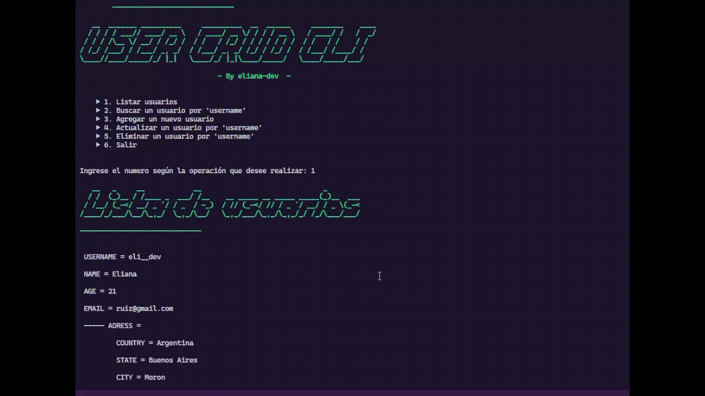

# 👥 User-Crud-Cli

  

## ⚡ Sobre el proyecto
Es una aplicación de línea de comandos (CLI) creada para practicar y fortalecer mis habilidades como **backend developer**.
El proyecto está desarrollado en **Python** y utiliza librerías como:

- **pymongo**: para conectarse a la base de datos MongoDB.

- **pydantic**: para validar y serializar los datos de entrada.

- **colorama**: para agregar estilo y color a los mensajes en la terminal.

## 📖 Listar usuarios
Muestra a todos los usuarios que se encuentran almacenados en la base de datos.

## 🔍 Buscar un usuario por 'username'
Te permiten encontrar un usuario especifico usando su username.

## 📥 Agregar un nuevo usuario

## 📝 Actualizar un usuario por 'username'

## 🗑️ Eliminar un usuario por 'username'
